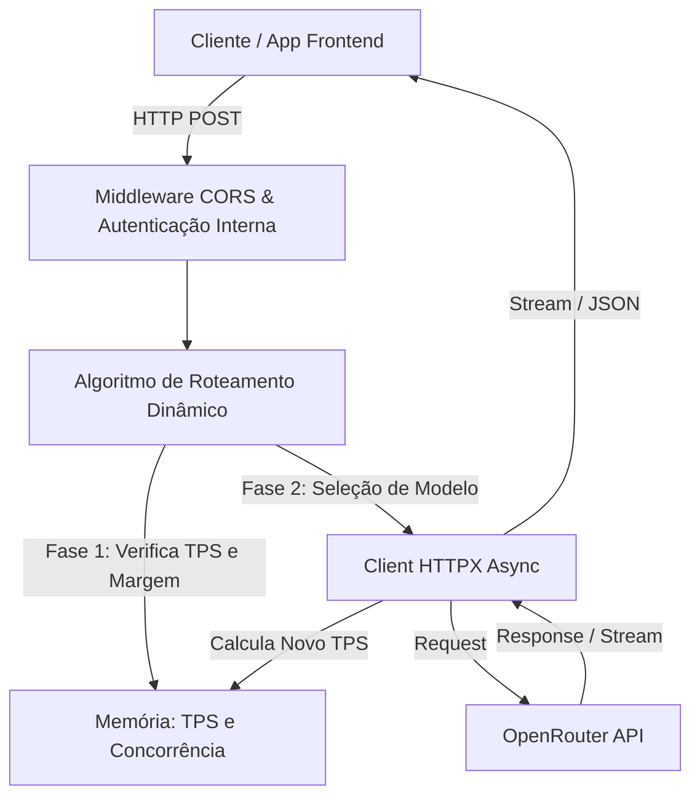

# 📁 API_LLM_Router

> **Versão da Documentação:** 1.0.0  
> **Última Atualização:** 2026-06-10  
> **Status:** Ativo

---

## 🎯 Visão Geral (The Blueprint)
Este diretório centraliza o gateway inteligente de roteamento e balanceamento de requisições para LLMs via OpenRouter. Ele atua como um *proxy reverso* ou intermediário, isolando os clientes da complexidade de lidar com rate limits, indisponibilidades e variação de latência entre múltiplos provedores (Google, Anthropic, Meta, OpenAI). A responsabilidade principal deste módulo não é processar inteligência artificial, mas sim garantir resiliência e alta disponibilidade através de um algoritmo de roteamento dinâmico baseado no monitoramento em tempo real da vazão (Tokens Por Segundo) e da concorrência de requisições.

---

## 🏗️ Arquitetura e Fluxo de Dados
A API recebe requisições no padrão OpenAI e atua como uma fachada (*Facade*). Ela avalia o estado atual da memória (requisições ativas e histórico de TPS de cada modelo) para tomar a decisão de roteamento. O payload sofre enriquecimento (adição do parâmetro `preset`) e é repassado ao upstream (OpenRouter). O retorno pode ser via repasse bloqueante (*blocking JSON*) ou transmissão em fluxo contínuo (*Server-Sent Events / Streaming*).

* **Entrada:** Requisições HTTP POST (formato compatível com OpenAI) vindas de clientes ou de outras partes do sistema Educampo, incluindo parâmetros de streaming.
* **Saída:** Resposta JSON (repasse direto do LLM) ou Streaming em chunks, calculando o TPS no encerramento da conexão.

---

## 🗂️ Mapeamento de Componentes

### 📄 Arquivos Chave

#### `📄 main.py`
* **Responsabilidade:** Arquivo principal da aplicação FastAPI. Contém a configuração de middlewares, rotas, lógica de balanceamento dinâmico e controle de memória.
* **Principais Funções/Classes:**
  * `get_best_model()`: Executa o algoritmo em duas fases: prioriza os modelos mais rápidos que não estouraram a margem (`MODEL_MARGIN`), e, caso todos estejam saturados, balanceia pelo menor número absoluto de requisições.
  * `route_llm_request()`: O endpoint de proxy reverso (`/v1/chat/completions`). Identifica a intenção de *streaming*, altera o payload para injetar o modelo selecionado e gerencia o rastreamento do tempo e dos tokens para alimentar a tabela hash de TPS local.
  * `clean_env_str()`: Auxiliar para sanitizar strings carregadas via variáveis de ambiente, prevenindo bugs clássicos de aspas literais no uso do `--env-file` do Docker.
* **Dependências Críticas:** Fortemente acoplado ao `httpx` (para streaming assíncrono transparente) e ao `fastapi`.

#### `📄 test_api.py`
* **Responsabilidade:** Suíte de testes automatizados e integração para garantir os limites operacionais e a validação de segurança.
* **Principais Funções/Classes:**
  * `test_security_*`: Garantem as regras de barreira de acesso.
  * `test_concurrency`: Estressa a aplicação para garantir a distribuição assíncrona (usando `asyncio.gather`) de várias requisições paralelas, testando a integridade e os limits do `httpx.AsyncClient`.
* **Dependências Críticas:** Requer o `pytest`, `pytest-asyncio`, `python-dotenv` e bibliotecas de concorrência.

#### `📄 Dockerfile`
* **Responsabilidade:** Garantir o empacotamento da aplicação para deploy seguro e previsível.
* **Dependências Críticas:** Usa a base `python:3.11-slim` para menor footprint de disco. Força propositalmente a instrução `--workers 1` do Uvicorn. Esta é uma decisão crítica: como a memória e a lógica do algoritmo (TPS) ficam no espaço global do Python local, múltiplos workers perderiam a contagem de TPS compartilhada.

---

## 🧠 Decisões de Design & Trade-offs

* **Decisão:** Controle de concorrência e TPS armazenado diretamente na memória RAM (Dicionários globais `active_requests` e `model_tps`), atrelado a um `Dockerfile` configurado para subir apenas **1 worker** (`--workers 1`).
* **Motivo:** Redução drástica da complexidade de infraestrutura. Ao não exigir o uso de um Redis ou cache distribuído para compartilhar o estado dos locks, a API permanece extremamente simples de se fazer deploy, sendo suficiente para o controle da taxa de vazão isolada.
* **Trade-off / Débito Técnico:** Não suporta escalonamento horizontal nativo (`scale-out`). Se a aplicação precisar ser distribuída por trás de um Load Balancer (com várias instâncias/containers rodando paralelamente), o controle da margem de concorrência será fragmentado por container. Será necessária a implementação de um Redis e de Locks distribuídos numa futura refatoração.

* **Decisão:** Utilização do padrão Reverse Proxy Pass-Through com `httpx`.
* **Motivo:** Evita carregar as respostas (especialmente as geradas via stream) completamente para a memória local. O chunk recebido pela conexão TCP com o provedor já é automaticamente repassado para a conexão TCP do cliente.
* **Trade-off / Débito Técnico:** Adiciona complexidade na contabilidade exata de tokens. Em streams, os tokens são inferidos aproximando o número de chunks recebidos no gerador assíncrono, diferente das requisições bloqueantes que provêm um dicionário `usage`. O cálculo de TPS de streaming possui margem de imprecisão heurística.

---

## 🧪 Estratégia de Testes

* **Tipo de Teste dominante:** Testes de Integração e Sistema usando Pytest. A estratégia foca no comportamento da borda da API em vez de testes puramente unitários simulados em memória.
* **Cenários Críticos:** 
  * Verificação rigorosa de barreiras de roteamento (`test_security_wrong_token`, `test_security_no_token`).
  * Processamento do Pass-Through assíncrono para endpoints SSE (`test_streaming`).
  * Concorrência paralela agressiva (`test_concurrency`) para validar a resiliência do balanceamento em estresse multithread/asyncio.
* **Estratégia de Mocking:** O projeto reduz o uso extremo de mocks virtuais. Os testes são criados para rodarem contra o ambiente vivo e empacotado (`Docker`). A biblioteca `python-dotenv` é utilizada unicamente na suíte de testes para espelhar as definições locais àquelas passadas via `--env-file` no container, validando uma semântica ponta a ponta sem mascarar falhas de parsing de credenciais.
