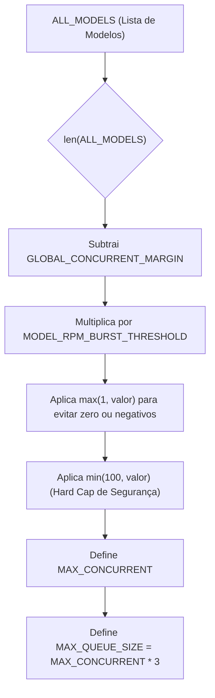

# 📁 domain / Camada de Domínio

> **Projeto:** API_LLM_Router
> **Branch:** feature/dynamic-concurrency-cap
> **Versão da Documentação:** 1.0.0
> **Última Atualização:** 2026-06-30
> **Status:** Active

---

## 🎯 Visão Geral (The Blueprint)

Este é o núcleo da aplicação. O módulo isola os contratos rígidos de tipagem (DTOs Pydantic) e os cálculos lógicos para a tomada de decisões de balanceamento de carga e enfileiramento (Fair Queue). Regras de negócio puras (agora desacopladas do FastAPI) habitam aqui, focadas em resiliência e failover de instâncias de IA.

---

## 🏗️ Arquitetura e Fluxo de Dados

**Reference Note:** [[2026-06-30-dynamic-concurrency-cap-architecture]]

---

## 🗂️ Mapeamento de Componentes

### 📄 Arquivos Chave

#### `📄 routing.py`

* **Responsabilidade:** Selecionar o melhor modelo LLM disponível baseado em RPM, latência e status de penalização temporal (cooldown).
* **Principais Funções/Classes:**
    * `get_best_model`: Algoritmo principal de seleção O(n). Faz uso intenso de `rpm_cache` (memoization).
    * `_calculate_max_concurrent`: Implementa as heurísticas numéricas para o tamanho das filas e limites do Semáforo.

#### `📄 dto.py`

* **Responsabilidade:** Validation Schema estrita usando Pydantic.
* **Principais Funções/Classes:**
    * `ChatCompletionRequest` / `ChatMessage`: Previne payload bypass limitando propriedades (`max_length`).

---

## 🧠 Decisões de Design & Trade-offs

* **Decisão:** Memoização de chamadas (cache) durante as iterações de ranking dentro de `get_best_model`.
* **Motivo:** Evitar recalcular a limpeza de deque (operações redundantes O(N)) várias vezes dentro do mesmo ciclo síncrono.
* **Trade-off / Débito Técnico:** Estado da memoização fica defasado se o método `get_best_model` demorar, mas a sua complexidade intrínseca garante micro-segundos, tornando a defasagem irrelevante.

---

## 🧪 Estratégia de Testes

* **Tipo de Teste dominante:** Testes Unitários Isolados sem I/O.
* **Cenários Críticos:** Valores negativos em limites de burst, hard limits com pool cheio, e teste de estresse de complexidade assintótica (performance da iteração).

---

## Related Context

*Links to vault notes documenting this module:*
- [[2026-06-30-dynamic-concurrency-cap-architecture]]
